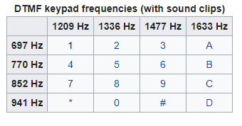

# Signal decoding via Fourier Transform

## Introduction

Imagine you are spy agent and want to catch bad guys. Your team’s target “the bad guy” went to the restaurant and started to dial to his boss to convey secret information. The bad guy is very cautious and therefore instead of using his own mobile phone he uses a telephone near the bar. Your team is disguised as customers and sitting around the bar. You cannot see what numbers he is dialing but you have a sensitive microphone with you. Instead of looking to what numbers he has dialed, you have recorded sounds of buttons on the telephone. To your team’s luck, the telephone is an old landline phone that uses DTMF tones for each of the buttons. Your mission is to find to what number the bad guy called.

##  What is a DTMF? 

The DTMF is a signaling system for recognizing the keys or on the dialed number of a push button or simply we can say it as a DTMF keypad. It is a combination of two sine wave tones to constitute a key. The tones are called as a rows & Colum frequencies and they are represented on the DTMF keypad.

In the dual tone multi-frequency, if we press any key on your phone, then it generates two tones of specific frequencies, the first specific frequency is a high frequency of tone and the second one is a low frequency of the tone. The following table shows the signals that you send when you press your touch tone phone keys: (Ignore “*” and “#” signs)

Reference: [Link](https://en.wikipedia.org/wiki/Dual-tone_multi-frequency_signaling)

## The Task

1. Write Fourier Transform (Fast Fourier Transform) code to analyze the signal (source file)
2. You can analyze the signal piece by piece by separating between numbers dialed (The DTMF signal will usually begin and end with a period of silence. In addition, each DTMF digit in the sequence is separated by silences. So use silence to your advantage)
3. Once you decode the signal you should report what number was dialed  
4. Make software that can decode any given signal automatically into phone numbers (I will give different signal and it should correctly decode it)

### The materials attached:

1. The source files recorded : “Project1_v1.wav”, “Project1_v2.wav”, “Project1_v3.wav”, “Project1_v4.wav”
2. Once you have Fourier Transformed the signal try to understand what each bin in X axis represents (Frequency, Hz) and learn how to calculate it. It will help you to plot with correct values in X-axis.
3. Keep in mind that the peak frequencies might be ±1~4 Hz from the center frequencies from DTMF table above due to noise.
